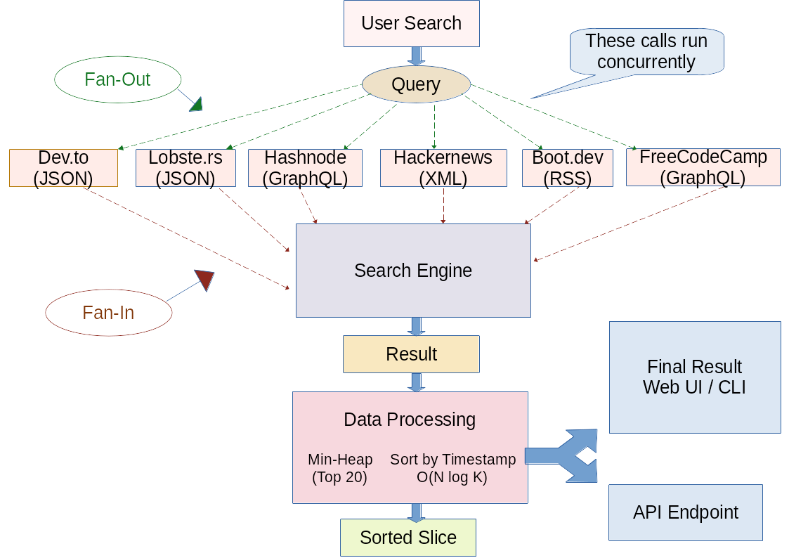

# Architecture: GRIP Aggregator (Go Reader Interface Processor)

## Overview
GRIP is a **headless, concurrent search engine** built to aggregate developer-centered blog content into a single stream. The goal was a "Logic-First" approach: keeping the engine's "brain" entirely separate from how the data is actually seen (web, JSON, or CLI). This ensures that the engine doesn't care if it's feeding a browser, terminal or a separate application.

## Core Components

### 1. The Headless Engine (internal/logic)
The engine is the central brain. It is completely "source-agnostic". It doesn't know about HTTP or HTML; it just accepts a search string and a context, manages the concurrency, and hands back a clean slice of results.

### 2. Source Agnosticism & Strategy Pattern
The project uses a Source interface to stay scalable. 
* **The Benefit:** We can plug in new providers, whether they use JSON, GraphQL or RSS, by just implementing the search method.
* **Dependency Injection:** Sources are "injected" at the entry point (main.go), so the engine never has to hardcode a specific provider.

### 3. Concurrency: Fan-Out / Fan-In
Originally, GRIP processed searches sequentially, which was too slow (~1000ms). By moving to a **Fan-Out** pattern:
* Every source gets its own goroutine.
* A sync.WaitGroup ensures we don't return until everyone is finished or the timeout hits.
* This brought response times down to a sub 500ms even with six sources active.

## Technical Design Decisions

### Smart Sorting with Min-Heaps
To keep the memory footprint constant, GRIP uses a **Min-Heap** (resultsHeap) for a "Top 20" newest posts leaderboard. 
* **Why:** Instead of sorting a massive slice in memory, we maintain exactly 20 items. As new posts come in, we only keep them if they are newer than the oldest item on the heap. This is $O(N \log K)$ efficiency.

### Resilience & "Good Citizen" Networking
* **Timeouts:** We use context.WithTimeout to enforce a strict 2-second limit. This prevents one hanging API from stalling the whole app.
* **Connection Pooling:** We use a custom http.Client with MaxIdleConnsPerHost to keep the "piping" efficient and avoid exhausting file descriptors.
* **Safety Clauses:** The engine includes date-parsing fallbacks to ensure a single malformed timestamp doesn't crash the aggregator.

## Headless Proof: Multiple Entry Points
The decoupling is proven by the existence of two different "heads" using the same internal logic:
1. **Web (cmd/grip):** Uses html/template for a card-view UI as well as providing a Swagger-documented API.
2. **CLI (cmd/cli):** A terminal-based tool for quick searches without the overhead of a web server.